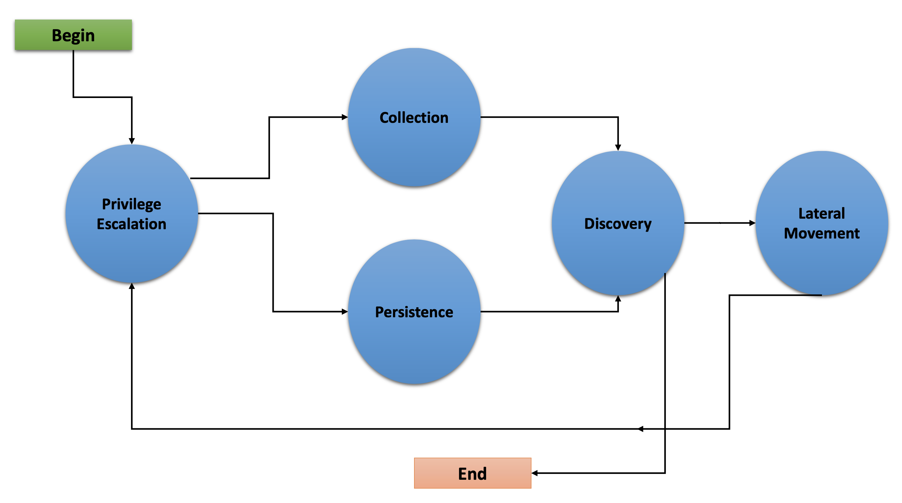

How to Build Planners
================

For any desired planner decision logic not encapsulated in the default _batch_ planner (or any other existing planner), CALDERA requires that a new planner be implemented to encode such decision logic.

## Buckets

The cornerstone of how planners make decisions is centered on a concept we call 'buckets'. Buckets denote the planner's state machine and are intended to correspond to _buckets_ of CALDERA abilites. Within a planner, macro level decision control is encoded by specifying which buckets (i.e. states) follow other buckets, thus forming a bucket state machine. Micro level decisions are made within the buckets, by specifying any logic detailing which abilities to send to agents and when to do so.

CALDERA abilities are also tagged by the buckets they are in. By default, when abilites are loaded by CALDERA, they are tagged with the bucket of the ATT&CK technique they belong to. CALDERA abilities can also be tagged/untagged at will by any planner as well, before starting the operation or at any point in it. The intent is for the defined planner buckets to work with the abilities that have been tagged for that bucket, but this is by no means enforced.

## Creating a Planner

Lets dive in to creating a planner in order to see the level of flexibility and power found in the CALDERA planner component. For this example, we will implement a planner that will carry out the following state machine:



The planner will consist of 5 buckets:  _Privilege Escalation_, _Collection_, _Persistence_, _Discovery_, and _Lateral Movemnent_. As implied by the state machine, this planner will use the underlying adversary abilities to attempt to spread to as many hosts as possible and establish persistence. If persistence is prevented by unsuccessful attempts to get required privilege access for a given host, then execute collection abilities immediately in case it loses access to the host.

We will create a python module called ```privileged_peristence.py``` and nest it under ```/app``` in the ```mitre/stockpile``` plugin.

**_First, lets build the static initialization of the planner:_**

```python
class LogicalPlanner:

    def __init__(self, operation, planning_svc, stopping_conditions=()):
        self.operation = operation
        self.planning_svc = planning_svc
        self.stopping_conditions = stopping_conditions
        self.stopping_condition_met = False
        self.state_machine = ['privilege_escalation', 'persistence', 'discovery', 'lateral_movement']
        self.next_bucket = 'privilege_escalation'

```

Breaking this down:

```python
    def __init__(self, operation, planning_svc, stopping_conditions=()):
        self.operation = operation
        self.planning_svc = planning_svc
        self.stopping_conditions = stopping_conditions
        self.stopping_condition_met = False
```
The ```__init__()``` method for a planner must take and store the required arguments for the ```operation``` instance, ```planning_svc``` handle, and any supplied ```stopping_conditions```.  Additionally ```self.stopping_condition_met``` is set to False to begin with.

```python
        self.state_machine = ['privilege_escalation', 'persistence', 'discovery', 'lateral_movement']
```
The ```state_machine``` variable is an optional list enumerating the base line order of the planner state machine. This ordered list **_does not_** control the planner bucket execution order but is used to define a base line state machine that we can refer back to in our decision logic.  For example, our _privileged persistence_ is more complex than a simple cycle but we can still use this ```state_machine``` variable to define a base line state machine that we can refer back to in our decision logic; this will be demonstrated below when we create the bucket (i.e. state) methods.

```python
        self.next_bucket = 'privilege_escalation'
```
The ```next_bucket``` variable holds the next bucket to be executed, that is the next bucket (i.e. state) that the planner will enter and whose bucket method will control the planning logic until. Initially, we set ```next_bucket``` to the first bucket the planner will begin in. We will moidfy ```next_bucket``` from within our bucket methods in order to specify the next bucket to execute.

_Additional Planner class variables_

It is also important to note that a planner may define any required variables that it may need. For instance, many custom planners require information to be passed from one bucket (state) to another during execution. This is done simply by creating a class variable(s) to store information that will persist between bucket transitions and can be accessed within any bucket method.

**_Now, lets the define the planner's entrypoint method ```execute()```. ```execute()``` is where the planner starts and where any runtime initialization is done._**

```python
    async def execute(self):
        await self.planning_svc.execute_planner(self)
```
For our planner, no further runtime initialization is required in the ```execute()``` method. To execute our buckets, however, we would need to code a loop that allows execution to transition from bucket to the next desired bucket until completion. However, because this is a common execution flow for a planner's buckets, this is made available in the planning service's ```execute_planner()``` method. ```execute_planner()``` works by executing the bucket specified by ```self.next_bucket``` and then when one bucket finishes execution, executing the next bucket (again specified by ```self.next_bucket```) until completion or if any of the planner's stopping conditions are met.

**_Finally, lets create our bucket methods, where all inter-bucket transitions and intra-bucket logic will be encoded. For every bucket (state) in our planner state machine, we must define a corresponding bucket method._**

```python
    async def privilege_escalation(self):
        ability_links = self.planning_svc.get_links(operation, buckets=['privilege escalation'])
        paw = ability_links[0].paw
        link_ids = [await self.operation.apply(l) for l in ability_links]
        await self.operation.wait_for_links_completion(link_ids)
        successful = self.operation.has_fact('{}.privilege.root'.format(paw), True) or self.operation.has_fact('{}.privilege.admin'.format(paw), True)
        if successful:
            self.next_bucket = 'persistence'
        else:
            self.next_bucket = 'collection'

    async def persistence(self):
        await self.planning_svc.exhaust_bucket(self, 'persistence', self.operation)
        self.next_bucket = await self.planning_svc.default_next_bucket('persistence', self.state_machine)

    async def collection(self):
        await self.planning_svc.exhaust_bucket(self, 'collection', self.operation)
        self.next_bucket = 'discovery'

    async def discovery(self):
        await self.planning_svc.exhaust_bucket(self, 'discovery', self.operation)
        lateral_movement_unlocked = bool(len(self.planning_svc.get_links(operation, bucket=['lateral_movement'])))
        if lateral_movement_unlocked:
            self.next_bucket = await self.planning_svc.default_next_bucket('discovery', self.state_machine)
        else:
            # planner will transtion from this bucket to being done
            self.next = None

    async def lateral_movement(self):
        await self.planning_svc.exhaust_bucket(self, 'lateral_movement', self.operation)
        self.next_bucket = 'privilege_escalation'
```

Lets look at each of the bucket methods in detail:

```privilege_escalation()``` - We first use ```get_links()```  from the planning service to retrieve all available links (ability commands) for abilities tagged as _privilege escalation_ , from the set of abilities in the underlying adversary. We then push these links to the agent with ```apply()```. We then wait for these links to complete with ```wait_for_links_completion()```. After the links complete, we check for the creation of custom facts that indicate the privilege escalation was actually successful (Note: this assumes the privilege escalation abilities we are using were modified to create aforementioned facts). If privilege escalation was successful, set the next bucket to be executed to _persistence_, otherwise _collection_.

```persistence()```, ```collection()```, ```lateral_movement()``` - These buckets have no complex logic, we just want to execute all links available and are tagged for the given bucket. We can also just use planning service utility ```exhaust_bucket()``` to apply all links for a given bucket tag and wait for their completion. Before exiting, we set the next bucket as desired.

```discovery()``` - This bucket starts by running all _discovery_ ability links available. Then we utilize a useful trick to determine if the planner should proceed to the _lateral movement_ bucket. We use ```get_links()``` to determine if the _discovery_ links that were just executed ended up unlocking ability links for _lateral movement_. From there we set the next bucket accordingly. 


**_Additional Notes on Privileged Persistance Planner_**
- You may have noticed that the _privileged_persistence_ planner is only notionally more sophisticated than running certain default adversary profiles. This is correct. If you can find or create an adversary profile whose ability enumeration (i.e. order) can carry out your desired operational progression between abilities and can be executed in batch (by the default _batch_ planner) or in a sequentially atomic order (by _atmomic_ planner), it is advised to go that route. However, any decision logic above those simple planners will have to be implemented in a new planner.
- The _privileged persistence_ planner did not have explicit logic to handle multiple agents. We just assumed the planner buckets would only have to handle a single active agent given the available ability links returned from the planning service. 

## A Minimal Planner

Custom planners do not have to use the buckets approach to work with the CALDERA operation interface if not desired. Here is a minimal planner that will still work with the operation interface.

```python

class LogicalPlanner:

    def __init__(self, operation, planning_svc, stopping_conditions=()):
        self.operation = operation
        self.planning_svc = planning_svc
        self.stopping_conditions = stopping_conditions
        self.stopping_condition_met = False

    async def execute(self):
        #
        # Implement Planner Logic
        #
        return

```

## Planning Service Utilities

Within a planner, these utilites are available from ```self.planning_svc```.

```exhaust_bucket()```

```default_next_bucket()```

```add_ability_to_next_bucket()```

```execute_planner()```

```get_links()```

```get_cleanup_links()```

```check_stopping_conditions()```

```upgrade_stopping_conditions()```


## Operation Utilities

Within a planner, these utilities are available from ```self.operation```.

```appy()```

```wait_for_links_completion()```

```all_facts()```

```has_fact()```

```all_relationships()```

```active_agents()```
